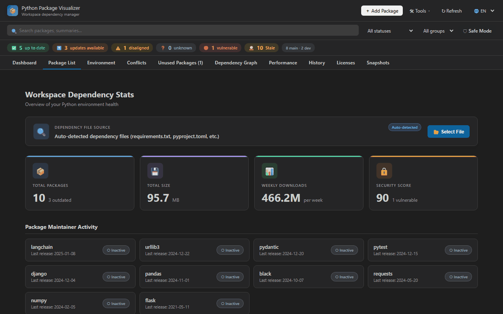
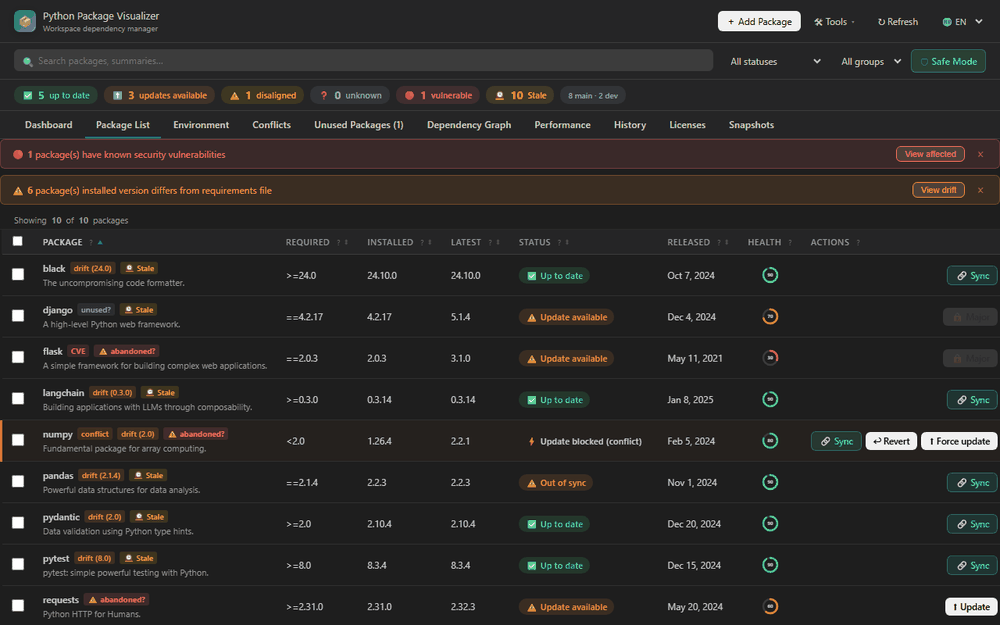
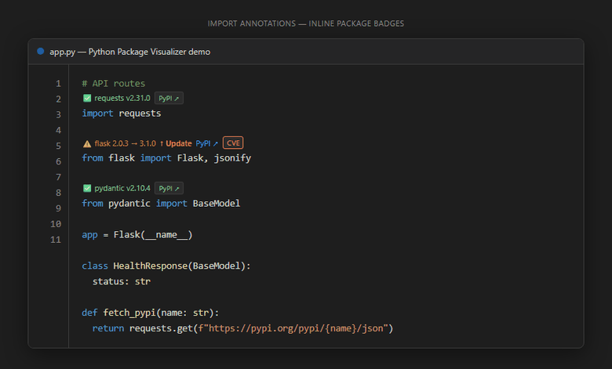
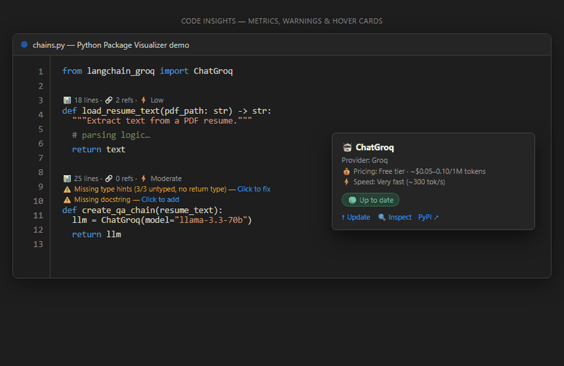
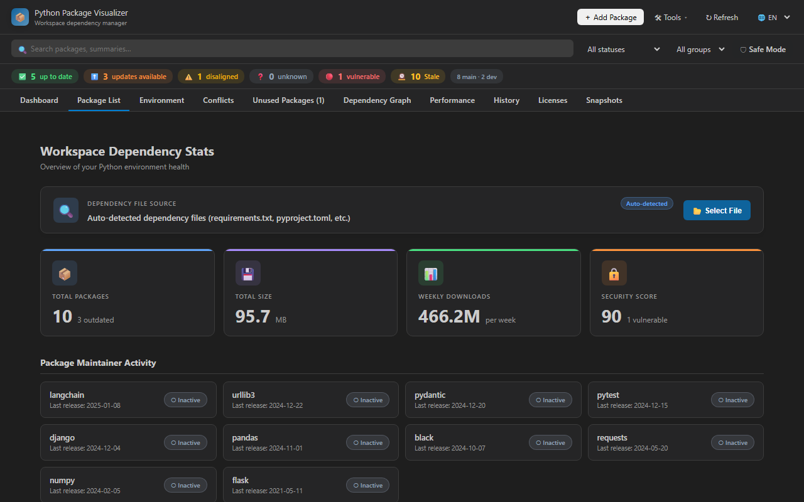
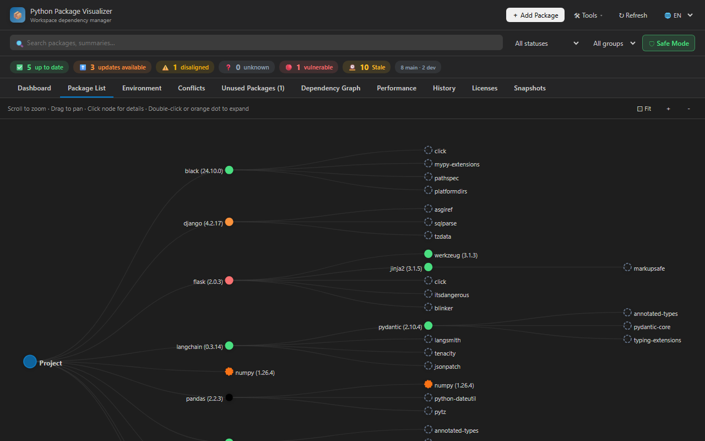
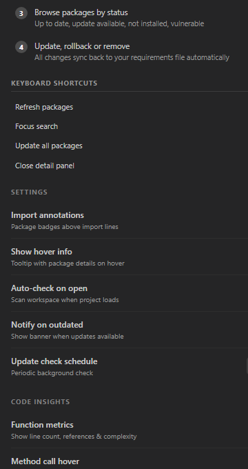

<div align="center">

# 📦 Python Package Visualizer

**The ultimate dependency manager for Python projects in VS Code**


*Visualize, manage, and audit your Python workspace dependencies — all from inside VS Code.*



</div>

---

## ✨ Why Python Package Visualizer?

Every Python developer has been there: `pip list --outdated` is noisy, `requirements.txt` gets out of sync, CVEs go unnoticed, unused packages bloat your environment, and dependency conflicts break your builds. **This extension fixes all of that — visually.**

- 🎯 **See everything at a glance** — dashboard, dependency graph, health score
- 🔒 **Catch vulnerabilities early** — CVE badges pulled from PyPI advisory DB
- 🧹 **Clean up bloat** — find packages that aren't imported anywhere
- ⚡ **Update safely** — Safe Mode blocks major-version jumps
- 📸 **Rollback confidently** — environment snapshots & update history

---

## 🎬 Demo

<div align="center">

### Package List & Updates


### Import Annotations


### Code Insights — Hover & Function Metrics


### Dashboard & Analytics


### Dependency Graph


</div>

---

## 🚀 Quick Start

1. Open a Python project containing `requirements.txt`, `pyproject.toml`, or `setup.py`
2. Click the **📦 icon** in the Activity Bar (left side)
3. Click **▶ Open Package Visualizer** in the sidebar

That's it. Everything is automatic from there.

---

## 🎯 Core Features

### 📋 Package Management
| Feature | What it does |
|---|---|
| **Package List** | Sortable table of all dependencies with installed vs latest versions |
| **One-click Update** | Update a single package or all at once |
| **Rollback** | Revert to a previously installed version |
| **Install New** | Search PyPI and install packages directly |
| **Pin Versions** | Lock packages to their current version in `requirements.txt` |
| **Remove Unused** | Delete packages from requirements with one click |
| **Bulk Actions** | Select multiple packages and update/remove together |

### 🧠 Code Intelligence

**Import Annotations** — see package status right above each import line:
```python
✅ requests v2.31.0      ↗ PyPI
import requests

⚠️ flask 2.0.1 → 3.0.3   ↑ Update    ↗ PyPI
from flask import Flask
```

**Function Metrics** — quality insights above every function:
```python
# 📊 18 lines · 🔗 2 refs · ⚡ Low
def load_resume_text(pdf_path: str) -> str:
    """Extract text from PDF."""
    ...

# 📊 25 lines · 🔗 0 refs · ⚡ Moderate
# ⚠️ Missing type hints (3/3 untyped, no return type) — Click to fix
# ⚠️ Missing docstring — Click to add
def create_qa_chain(resume_text):
    ...
```

**Smart Hover Cards** — hover any imported symbol for a compact card:
```
📦 langchain · v1.2.15 · MIT
Building applications with LLMs through composability
🟢 Up to date · 🐍 >=3.10 · 📅 2 days ago
↑ Update · 🔍 Inspect · PyPI ↗
```

**API Cost Hints** — hover on LLM clients like `ChatGroq`, `ChatOpenAI`:
```
🤖 ChatGroq
Provider: Groq
💰 Pricing: Free tier · ~$0.05-0.10/1M tokens
⚡ Speed: Very fast (~300 tok/s)
```

### 🔒 Security & Compliance
| Feature | What it does |
|---|---|
| **CVE Detection** | Vulnerabilities flagged from PyPI advisory DB |
| **License Risk** | Classifies MIT/BSD/Apache as safe, GPL/AGPL as restricted |
| **Safe Mode** 🛡️ | Blocks major-version updates to prevent breaking changes |
| **Python Compatibility** | Warns when packages require newer Python |

### 📊 Visualization & Analytics

- **Dashboard** — health score, weekly downloads, security stats, maintainer activity
- **Dependency Graph** — interactive D3.js tree with collapsible nodes
- **Performance** — ranks packages by install time (Fast/Moderate/Slow)
- **History** — timeline of all updates, installs, rollbacks
- **Licenses** — packages grouped by license with risk badges
- **Snapshots** — save and restore your entire environment

### 🛠 Power Tools

Accessible from the **Export** dropdown in the main panel:

- **📤 Export Report** — Markdown or JSON snapshot of your dependencies
- **📦 Generate requirements.txt** — auto-scan imports and create `requirements.txt`
- **🐧 Setup Scripts** — generate Bash / PowerShell / Markdown setup scripts for onboarding
- **⚡ Migrate to uv** — convert `requirements.txt` → modern `pyproject.toml`
- **🎭 Migrate to Poetry** — convert to Poetry format

---

## ⚙️ Settings Panel



Every code insight is **toggleable from the sidebar** — no need to dig into VS Code settings.json.

### General Settings
- 🔘 Import annotations *(inline package badges)*
- 🔘 Show hover info
- 🔘 Auto-check on open
- 🔘 Notify on outdated packages
- 📋 Update check schedule *(Off / Daily / Weekly / Monthly)*

### Code Insights
- 🔘 Function metrics *(lines, references, complexity)*
- 🔘 Method call hover *(package info + API cost)*
- 🔘 Complexity warnings
- 🔘 Type hint coverage warnings
- 🔘 Docstring warnings

---

## ⌨️ Keyboard Shortcuts

Inside the Package Visualizer panel:

| Key | Action |
|---|---|
| `R` | Refresh packages |
| `/` or `Ctrl+F` | Focus the search bar |
| `U` | Update all outdated packages |
| `Esc` | Close detail panel |

---

## 🎯 What's New in v3.0.2

- 📝 **Import Annotations** above every import line with Update/Install quick actions
- 📊 **Function Metrics** (lines, references, complexity) above every `def`
- 💡 **Quick-fix CodeLens** — click "Missing docstring" to auto-insert a template
- 🔍 **Clickable References** — click `🔗 X refs` to open VS Code's Find All References panel
- 🤖 **Smart Hover Cards** — compact, actionable hover UI with health indicators
- 💰 **API Cost Hints** for LLM client classes (ChatGroq, ChatOpenAI, etc.)
- 🎨 **Redesigned tabs** — cleaner Dashboard, Performance, History, Unused, Licenses, Snapshots
- ⚙️ **Full Settings Panel** in the sidebar with 10 toggles
- 📦 **Environment Snapshots** — save and restore your full dependency state
- 🛡️ **Safe Mode** — blocks major-version updates to prevent breaking changes
- ⚡ **Migration Tools** — convert to uv / Poetry with one click
- 🚀 **Setup Script Generator** — Bash, PowerShell, and Markdown

See the [CHANGELOG](CHANGELOG.md) for the full history.

---

## 📋 Supported Project Types

The extension automatically detects and parses:

| File | Notes |
|---|---|
| `requirements.txt` | Main pip format |
| `requirements-dev.txt`, `requirements-test.txt`, `requirements-prod.txt` | Environment-specific |
| `pyproject.toml` | PEP 517/518/621, Poetry, PDM, Hatch, uv |
| `setup.py` | Legacy setuptools |
| `setup.cfg` | Declarative setuptools |
| `Pipfile` | Pipenv |

Virtual environments are auto-detected from: `.venv/`, `venv/`, `env/`, `.env/`.

---

## 🔧 Installation

### From VS Code Marketplace
1. Open VS Code
2. Go to **Extensions** (`Ctrl+Shift+X`)
3. Search **Python Package Visualizer**
4. Click **Install**

### From VSIX
```bash
code --install-extension python-package-visualizer-3.0.2.vsix
```

---

## 🏗️ Development

### Prerequisites

- [Node.js](https://nodejs.org/) **v18+**
- [npm](https://www.npmjs.com/) (bundled with Node.js)
- [VS Code](https://code.visualstudio.com/) **^1.107.0**

### Setup

```bash
# Clone the repository
git clone https://github.com/Elanchezhiyan-P/python-package-visualizer.git
cd python-package-visualizer

# Install dependencies
npm install
```

### Build Commands

| Command | Description |
|---|---|
| `npm run build` | Compile TypeScript → `dist/extension.js` via esbuild |
| `npm run watch` | Compile in watch mode (auto-rebuild on save) |
| `npm run lint` | Run ESLint on `src/` |
| `npm run pretest` | Compile test files via `tsc` |
| `npm run test` | Run extension tests with `@vscode/test-electron` |
| `npm run package` | Package the extension as `.vsix` via `vsce` |

### Typical Development Workflow

```bash
# 1. Start watch mode (keeps rebuilding on save)
npm run watch

# 2. Press F5 in VS Code to launch the Extension Development Host

# 3. Make changes → the watcher rebuilds automatically
#    Reload the dev host window (Ctrl+Shift+P → "Developer: Reload Window")

# 4. Before committing, verify a clean build
npm run build

# 5. Run linter
npm run lint

# 6. Package for distribution
npm run package
```

### Packaging a VSIX

```bash
# Install vsce globally (if not already)
npm install -g @vscode/vsce

# Package the extension
vsce package
# → produces python-package-visualizer-X.Y.Z.vsix

# Install locally for testing
code --install-extension python-package-visualizer-*.vsix
```

### Project Structure

```
python-package-visualizer/
├── src/                          # TypeScript source (compiled by esbuild)
│   ├── extension.ts              # Extension entry point (activate/deactivate)
│   ├── commands/
│   │   ├── commandController.ts  # Central command dispatcher
│   │   └── handlers/
│   │       ├── visualizerHandler.ts   # Core scan + update orchestration
│   │       ├── visualizer/
│   │       │   └── displayCompiler.ts # Payload building (shared by panel + sidebar)
│   │       ├── packageInstaller.ts    # pip install/update/rollback
│   │       ├── requirementsHandler.ts # Requirements file operations
│   │       ├── reportExporter.ts      # Markdown/JSON export
│   │       ├── snapshotHandler.ts     # Environment snapshots
│   │       ├── migrationHandler.ts    # uv/Poetry migration
│   │       └── utilityHandler.ts      # Misc utilities
│   ├── modules/
│   │   ├── importScanner.ts      # Facade — delegates to import/ sub-modules
│   │   ├── import/
│   │   │   ├── scanner.ts        # Python file scanning + import extraction
│   │   │   ├── confidence.ts     # Unused package confidence scoring
│   │   │   └── maps.ts           # stdlib, import-to-package mappings
│   │   ├── packageScanner.ts     # Requirements/pyproject/setup.py parser
│   │   ├── parsers/              # Format-specific parsers
│   │   ├── requirementsSync.ts   # Pin/unpin/remove from requirements
│   │   ├── requirementsGenerator.ts
│   │   ├── migrationHelper.ts
│   │   └── setupScriptGenerator.ts
│   ├── services/
│   │   ├── versionChecker.ts     # PyPI API queries
│   │   └── versionHistoryCache.ts # Local JSON history store
│   ├── providers/                # CodeLens, Hover, and Diagnostics providers
│   ├── ui/
│   │   ├── webviewPanel.ts       # Main webview panel manager
│   │   ├── sidebarProvider.ts    # Activity bar sidebar
│   │   └── statusBarManager.ts   # Status bar item
│   ├── data/                     # Static data (alternatives, API costs)
│   └── utils/                    # Logger, helpers
├── media/
│   ├── webview/
│   │   ├── index.html            # Main webview HTML template
│   │   ├── main.js               # Webview entry point
│   │   ├── js/
│   │   │   ├── state.js          # Global state management
│   │   │   ├── utils.js          # Shared utilities (esc, formatters)
│   │   │   ├── i18n.js           # i18n engine + static translations
│   │   │   ├── i18n/             # Language packs (en.js, it.js)
│   │   │   ├── filters.js        # Search, sort, filter logic
│   │   │   ├── table.js          # Package list table renderer
│   │   │   ├── tabs.js           # Tab router + shared tab utilities
│   │   │   ├── tabs/             # Per-tab renderers
│   │   │   │   ├── dashboard.js
│   │   │   │   ├── unused.js
│   │   │   │   ├── licenses.js
│   │   │   │   ├── performance.js
│   │   │   │   ├── history.js
│   │   │   │   └── snapshots.js
│   │   │   ├── detail.js         # Package detail side panel
│   │   │   ├── graph.js          # D3.js dependency graph
│   │   │   ├── modal.js          # Modal dialogs
│   │   │   └── tour.js           # Guided tour
│   │   └── css/
│   │       ├── base.css          # CSS custom properties + reset
│   │       ├── layout.css        # Header, toolbar, stats bar
│   │       ├── components.css    # Buttons, badges, tags, banners
│   │       ├── components/       # Extracted component styles
│   │       │   ├── loader.css
│   │       │   ├── empty-state.css
│   │       │   ├── modal.css
│   │       │   ├── export-menu.css
│   │       │   └── tour.css
│   │       ├── list-view.css     # Package table styles
│   │       ├── detail-view.css   # Detail panel styles
│   │       ├── graph-view.css    # Graph visualization styles
│   │       ├── tabs-view.css     # Tab bar controls
│   │       └── tabs/             # Per-tab styles
│   │           ├── dashboard.css
│   │           ├── unused.css
│   │           ├── licenses.css
│   │           ├── performance.css
│   │           ├── history.css
│   │           └── snapshots.css
│   └── sidebar/
│       ├── welcome.html          # Sidebar HTML template
│       └── welcome.js            # Sidebar settings + event handlers
├── test/                         # Extension integration tests
├── dist/                         # Compiled output (gitignored)
├── esbuild.js                    # Build script configuration
├── tsconfig.json                 # TypeScript compiler config
├── tsconfig.test.json            # Test-specific TS config
├── package.json                  # Extension manifest + npm scripts
└── .vscodeignore                 # Files excluded from VSIX package
```

---

## 🤝 Contributing

Issues and pull requests are welcome! See [CONTRIBUTING.md](CONTRIBUTING.md).

- 🐛 **Bug reports:** [GitHub Issues](https://github.com/Elanchezhiyan-P/python-package-visualizer/issues)
- 💡 **Feature requests:** same place — use the `enhancement` label
- 📖 **Documentation:** [GitHub Wiki](https://github.com/Elanchezhiyan-P/python-package-visualizer/wiki)

> **Before submitting a PR**, make sure `npm run build` and `npm run lint` pass cleanly.

---

## 👤 Author

**Elanchezhiyan P**
- 🌐 [codebyelan.in](https://codebyelan.in)
- 🐙 [github.com/Elanchezhiyan-P](https://github.com/Elanchezhiyan-P)

---

## 📜 License

MIT © [Elanchezhiyan P](https://codebyelan.in). See [LICENSE](LICENSE) for details.

---

## 📸 Screenshots & GIFs

All media is stored in `media/screenshots/`. Current assets:

| File | Type | Used in |
|---|---|---|
| `hero.gif` | GIF | Top hero banner |
| `package-list.gif` | GIF | Demo section — Package List & Updates |
| `import-annotations.gif` | GIF | Demo section — Import Annotations |
| `code-insights.gif` | GIF | Demo section — Code Insights |
| `dashboard.png` | PNG | Demo section — Dashboard |
| `dependency-graph.png` | PNG | Demo section — Dependency Graph |
| `settings-panel.png` | PNG | Settings Panel section |

**Recommended tools for recording new GIFs:**
- 🎞️ [ScreenToGif](https://www.screentogif.com/) *(Windows, free)*
- 🎞️ [Kap](https://getkap.co/) *(macOS, free)*
- 🎞️ [LICEcap](https://www.cockos.com/licecap/) *(cross-platform, free)*
